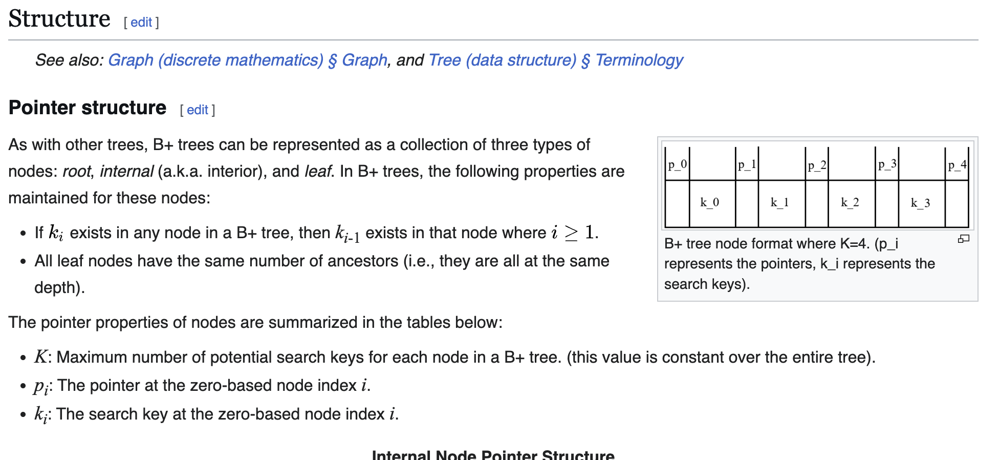
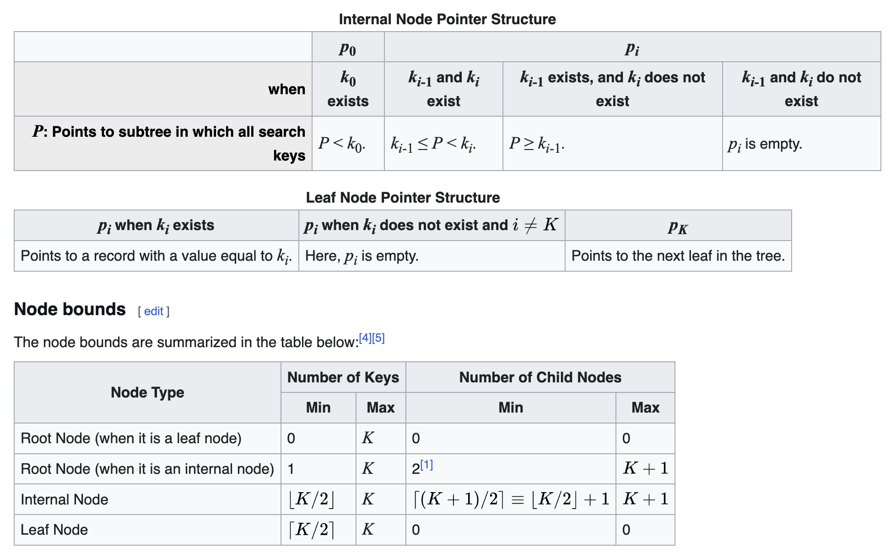
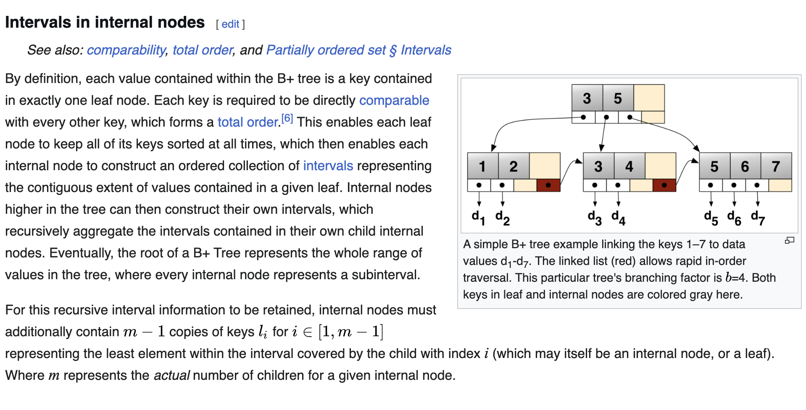
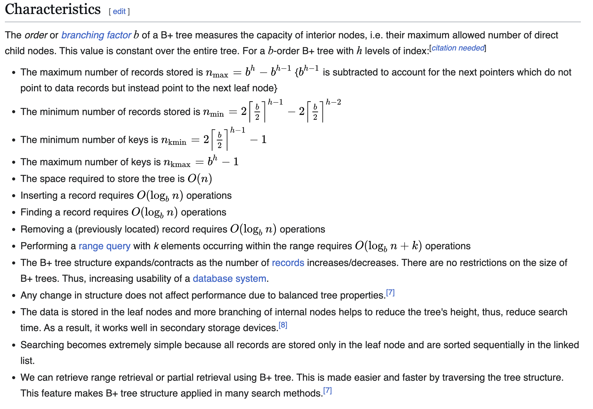
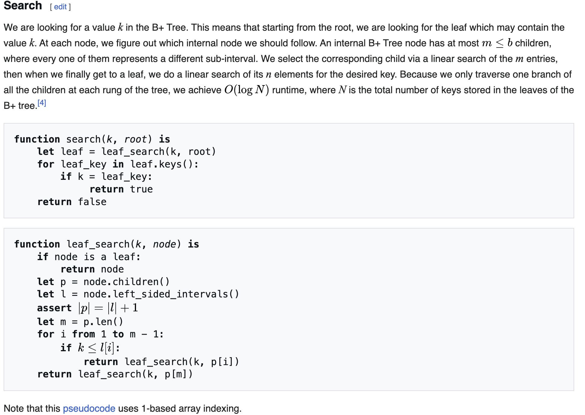
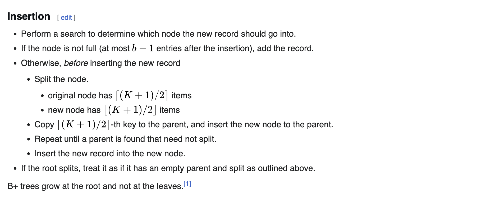
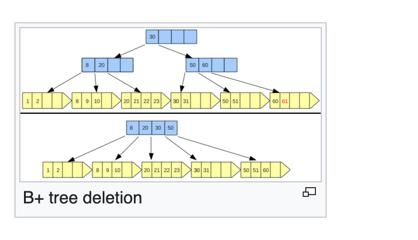
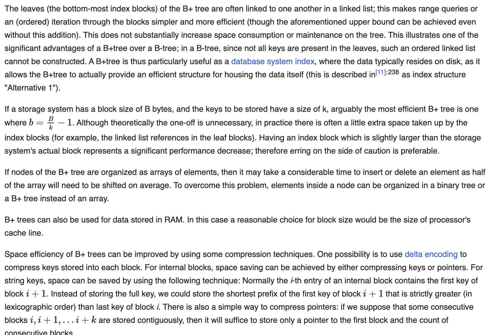
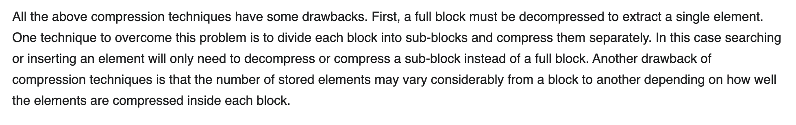

# B+ tree
| Type | Tree (data structure) | |
| ---- | ---- | ---- |
| Time complexity in big O notation | | |
| Operation	| Average	| Worst case |
| Search	| O(log n)	| O(log n) |
| Insert	| O(log n)	| O(log n) |
| Delete	| O(log n)	| O(log n) |
| Space complexity | | |
| Type	| Average	| Worst case |
| Space	| O(n)	| O(n) | 

A B+ tree is an m-ary tree with a variable but often large number of children per node. A B+ tree consists of a root, internal nodes and leaves.[1] The root may be either a leaf or a node with two or more children.

A B+ tree can be viewed as a B-tree in which each node contains only keys (not key–value pairs), and to which an additional level is added at the bottom with linked leaves.

The primary value of a B+ tree is in storing data for efficient retrieval in a block-oriented storage context—in particular, filesystems. This is primarily because unlike binary search trees, B+ trees have very high fanout (number of pointers to child nodes in a node,[1] typically on the order of 100 or more), which reduces the number of I/O operations required to find an element in the tree.

## History
There is no single paper introducing the B+ tree concept. Instead, the notion of maintaining all data in leaf nodes is repeatedly brought up as an interesting variant of the B-tree, which was introduced by R. Bayer and E. McCreight.[2] Douglas Comer notes in an early survey of B-trees (which also covers B+ trees) that the B+ tree was used in IBM's VSAM data access software, and refers to an IBM published article from 1973.[3]

## Structure
### Pointer structure

B+ tree node format where K=4. (p_i represents the pointers, k_i represents the search keys).
As with other trees, B+ trees can be represented as a collection of three types of nodes: root, internal (a.k.a. interior), and leaf. In B+ trees, the following properties are maintained for these nodes:

### Intervals in internal nodes

## Characteristics

## Algorithms
### Search

### Insertion

### Bulk-loading
Given a collection of data records, we want to create a B+ tree index on some key field. One approach is to insert each record into an empty tree. However, it is quite expensive, because each entry requires us to start from the root and go down to the appropriate leaf page. An efficient alternative is to use bulk-loading.

* The first step is to sort the data entries according to a search key in ascending order.
* We allocate an empty page to serve as the root, and insert a pointer to the first page of entries into it.
* When the root is full, we split the root, and create a new root page.
* Keep inserting entries to the right most index page just above the leaf level, until all entries are indexed.
Note:

* when the right-most index page above the leaf level fills up, it is split;
* this action may, in turn, cause a split of the right-most index page one step closer to the root;
* splits only occur on the right-most path from the root to the leaf level.[9]
### Deletion
The purpose of the delete algorithm is to remove the desired entry node from the tree structure. We recursively call the delete algorithm on the appropriate node until no node is found. For each function call, we traverse along, using the index to navigate until we find the node, remove it, and then work back up to the root.

At entry L that we wish to remove:

* If L is at least half-full, done
* If L has only d-1 entries, try to re-distribute, borrowing from sibling (adjacent node with same parent as L).
After the re-distribution of two sibling nodes happens, the parent node must be updated to reflect this change. The index key that points to the second sibling must take the smallest value of that node to be the index key.
* If re-distribute fails, merge L and sibling. After merging, the parent node is updated by deleting the index key that point to the deleted entry. In other words, if merge occurred, must delete entry (pointing to L or sibling) from parent of L.
Note: merge could propagate to root, which means decreasing height.[10]

## Implementation

## Applications
### File systems
The ReiserFS, NSS, XFS, JFS, ReFS, and BFS filesystems all use this type of tree for metadata indexing; BFS also uses B+ trees for storing directories. NTFS uses B+ trees for directory and security-related metadata indexing. EXT4 uses extent trees (a modified B+ tree data structure) for file extent indexing.[12] APFS uses B+ trees to store mappings from filesystem object IDs to their locations on disk, and to store filesystem records (including directories), though these trees' leaf nodes lack sibling pointers.[13]

### Database systems
Relational database management systems such as IBM Db2,[11] Informix,[11] Microsoft SQL Server,[11] Oracle 8,[11] Sybase ASE,[11] and SQLite[14][full citation needed] support this type of tree for table indices, though each such system implements the basic B+ tree structure with variations and extensions. Many NoSQL database management systems such as CouchDB[15][full citation needed][a] and Tokyo Cabinet[16] also support this type of tree for data access and storage.

Finding objects in a high-dimensional database that are comparable to a particular query object is one of the most often utilized and yet expensive procedures in such systems.[citation needed] In such situations, finding the closest neighbor using a B+ tree is productive.[17][full citation needed]

### iDistance
Further information: iDistance
B+ tree is efficiently used to construct an indexed search method called iDistance. iDistance searches for k nearest neighbors (kNN) in high-dimension metric spaces. The data in those high-dimension spaces is divided based on space or partition strategies, and each partition has an index value that is close with the respect to the partition. From here, those points can be efficiently implemented using B+ tree, thus, the queries are mapped to single dimensions ranged search. In other words, the iDistance technique can be viewed as a way of accelerating the sequential scan. Instead of scanning records from the beginning to the end of the data file, the iDistance starts the scan from spots where the nearest neighbors can be obtained early with a very high probability.[18]

### NVRAM
Further information: Non-volatile random-access memory
Nonvolatile random-access memory (NVRAM) has been using B+ tree structure as the main memory access technique for the Internet Of Things (IoT) system because of its non static power consumption and high solidity of cell memory.  B+ can regulate the trafficking of data to memory efficiently. Moreover, with advanced strategies on frequencies of some highly used leaf or reference point, the B+ tree shows significant results in increasing the endurance of database systems.[19]

:
